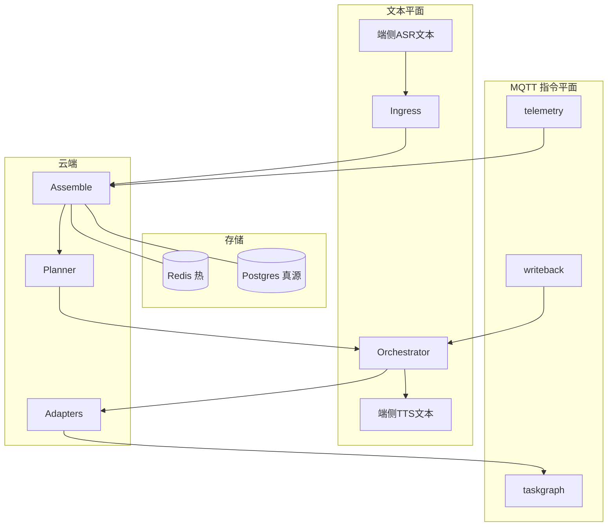
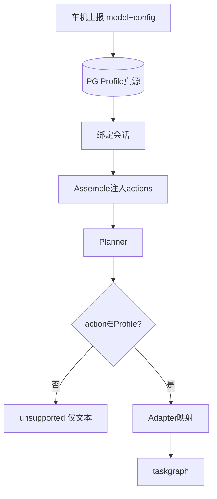
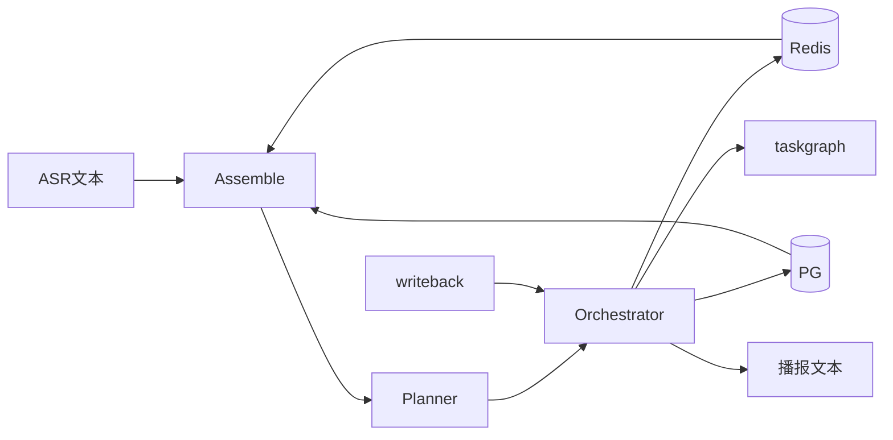
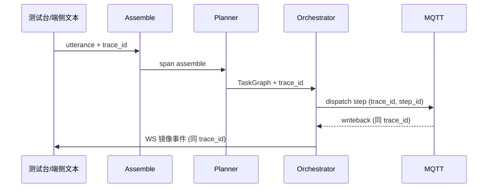

# 智能座舱语音对话 Agent — 详细技术方案

| 字段 | 内容 |
|------|------|
| 文档版本 | **detailed-v2.5**（共享底座契约 + 路由闸 + 弱出处 + rag_item_names） |
| 日期 | 2026-09-13 |
| 主笔 | AI 应用专家 |
| 依据 | PRD v1.13、群内锁定项、实现仓库 `voic-agent`（本地分支） |
| 状态 | 可评审；每章结构：**口径 → 字段/契约 → 示例数据 → 流程图（如有）** |

---

## 1. 目标与范围

### 口径
- 路线 **C**：LLM 规划出 TaskGraph + 独立编排引擎；车端执行与门控。
- 首版语音 **①**：端侧 ASR/TTS，云端只收发**文本**；音频不上云。
- 指令平面：MQTT（或同等长连接）`taskgraph` / `writeback` / `telemetry`。
- 测试台 WebSocket 仅镜像，不是车机主通道。

### 首版做 / 不做

| 做 | 不做 |
|----|------|
| 六域、L0–L2、Capability Profile | 视频检索 / `play_clip`（契约预留） |
| 手册文本 RAG + **弱出处 citations[]**（有 answer 即可） | 全舱多用户 / 多乘客记忆命名空间 |
| 多轮指代（实体缓冲）、改口、拒识、时空摘要 | 对话原文长期记忆 |
| Redis 热 / Postgres 真源 | 模型直调 ECU、模型算路 |

---

## 2. 总体架构

### 口径
双平面 + 六域 + 单 Agent（不按车型复制大脑）。



### 六域
`vehicle` | `navigation` | `media` | `calendar` | `knowledge` | `chitchat`

---

## 3. 数据与状态（冷热分层）

### 口径
- **Redis**：分钟～小时热数据，可丢可重建。
- **Postgres（+pgvector）**：长期真源、可审计、按车型/账号持久。
- **禁止**把长期偏好/审计只放 Redis。

### 对照表

| 数据 | 存储 | 示例用途 |
|------|------|----------|
| Session、实体缓冲、进行中 TaskGraph、L2 等待、`profile_switching` | Redis | 多轮、指代、确认倒计时 |
| 长期记忆白名单、Capability Profile 版本、手册元数据/向量、任务审计、时空事件摘要 | Postgres | 「帮我记」、换车型 Profile、手册 RAG、审计 |

### 示例：Redis Session（热）

```json
{
  "session_id": "s_20260913_01",
  "driver_id": "drv_eric",
  "vehicle_model": "model_a",
  "profile_state": "ready",
  "active_task_id": "t_001",
  "entities": [
    {"type": "poi", "id": "poi_chg_2", "name": "第2个充电站", "rank": 2, "ts": 1726200000}
  ],
  "pending_confirm_step_id": null,
  "ttl_hint_sec": 1800
}
```

### 示例：Postgres 长期记忆白名单（冷）

```json
{
  "driver_id": "drv_eric",
  "home_poi": {"id": "poi_home_01", "name": "家", "lat": 31.23, "lng": 121.47},
  "work_poi": {"id": "poi_work_01", "name": "公司"},
  "ac_pref_c": 22,
  "preferred_artist": "周杰伦",
  "updated_at": "2026-09-13T08:00:00Z"
}
```

### 切驾驶员
清：Redis 影子 + 实体缓冲 + 会话 Profile 绑定；切：Postgres 画像切片指针。不把上一任「那儿」带到下一任。

---

## 4. Capability Profile（车型适配）

### 口径
一套引擎 + 每车能力包。车机上报车型+配置，云端**不猜选装**。换车型/OTA：`profile_switching` → 暂停下行执行边 → 绑定新 Profile → `profile_ready`。

### 字段示例

```json
{
  "model_id": "model_a",
  "config_id": "base_2026",
  "options": {"sunroof": false, "door_lock_remote": true},
  "actions": ["set_ac_temp", "open_window", "lock_doors", "set_nav_goal", "play_media"],
  "param_limits": {"set_ac_temp": {"temp_c": {"min": 16, "max": 30}}},
  "l1_gates": {"open_window": ["gear_P_or_speed_lt_5"]},
  "version": 3
}
```

`model_b` 可多 `open_sunroof` 等 action。缺失能力 → 播报 `unsupported`，**MQTT 零执行边**。

### 专流



---

## 5. Planner（理解与出图）

### 口径
规划 = **系统提示（规则）** + **结构化动态块**（Profile/快照/记忆/Session）+ 用户话 → 严格 JSON TaskGraph。输出必须过 Schema/白名单；失败 repair 一次。

### 5.1 输入五件套（示例）

#### （1）系统提示（人定、相对稳定——写规则，不写某台车能力）

设计要点：
- 短约束、强格式：先 Schema，再 1～2 条 few-shot（多意图 + L2）
- Profile/快照/记忆用**独立结构化消息块**注入，不要塞进永久 system 大散文
- 只能从当前 `Profile.actions` 选型；缺槽追问；指代优先 `session.entities`
- 禁止自由工具名；不算路；手册必须 citations；闲聊不写长期记忆

**系统提示词示例（节选）：**

```text
你是座舱语音规划器。只输出符合 TaskGraph JSON Schema 的对象，不要解释。
规则：
1) domain 仅限 vehicle/navigation/media/calendar/knowledge/chitchat
2) vehicle/navigation/... 的 action 必须来自本轮提供的 Capability Profile.actions
3) 安全：L2（如 lock_doors）必须带 confirm.level=L2；不要直接当作已确认
4) 导航只出 NavGoal 约束与目的地槽位，不要输出路线几何
5) knowledge 答案必须可带 citations；无依据时不要编造手册结论
6) chitchat 不产生车控 step，不写长期记忆
7) 指代（那儿/它/第二个）优先解析 session.entities
8) 无法满足时输出追问或 unsupported，而不是编造 action
```

#### （2）Capability Profile（当前车）— 见 §4 示例

#### （3）运行时快照摘要（telemetry 节流后）

```json
{
  "gear": "D",
  "speed_kph": 36,
  "audio_zone": "driver",
  "nav_active": false,
  "hvac_temp_c": 24,
  "windows": {"front_left": 0.0}
}
```

#### （4）记忆白名单（PG → Assemble）

```json
{
  "home_poi": "poi_home_01",
  "work_poi": "poi_work_01",
  "ac_pref_c": 22,
  "preferred_artist": "周杰伦"
}
```

#### （5）用户话 + Session 热数据（Redis）

```json
{
  "utterance": "温度再低一点，然后导航去那儿",
  "session": {
    "task_id": "t_001",
    "entities": [
      {"type": "poi", "id": "poi_chg_2", "name": "第2个充电站", "rank": 2}
    ],
    "last_vehicle_object": "hvac"
  }
}
```

### 5.2 输出 TaskGraph 示例

```json
{
  "task_id": "t_002",
  "session_id": "s_20260913_01",
  "steps": [
    {
      "step_id": "s1",
      "branch_id": "b_vehicle",
      "domain": "vehicle",
      "action": "set_ac_temp",
      "params": {"temp_c": 21},
      "confirm": {"level": "L0"},
      "depends_on": []
    },
    {
      "step_id": "s2",
      "branch_id": "b_nav",
      "domain": "navigation",
      "action": "set_nav_goal",
      "params": {
        "NavGoal": {
          "destination": {"poi_id": "poi_chg_2", "name": "第2个充电站"},
          "route_prefs": {"avoidHighway": false, "strategyConvert": "DEFAULT"},
          "via": []
        }
      },
      "depends_on": []
    }
  ]
}
```

### 5.3 模型接入
DashScope OpenAI-compatible：`OPENAI_API_BASE` + `OPENAI_API_KEY` + `LLM_DEFAULT_MODEL`（如 `qwen3.8-27b`）。无 key 时规则兜底仅覆盖高频短指令。

---

## 6. 编排 Orchestrator

### 口径
- `depends_on`：显式先后；不写则可并行。车端**不解析**依赖，只收已放行执行帧。
- L0 直下发；L1 车端可 `rejected`（不回模型自动重试）；L2 **只门闩本 step**，确认前无执行边，15s → `confirm_timeout`。
- 同图非 L2 先跑；播报事件驱动增量，不 batch 终态。

### L2 + 并行示例语义
「锁车 + 开空调」→ 空调执行帧先下 MQTT；锁车 `waiting_confirm`；`accepted` 后再下锁车帧。

---

## 7. 通道与回写

### MQTT Topic
| Topic | 方向 | 内容 |
|-------|------|------|
| `cockpit/agent/taskgraph` | 云→车 | 已校验执行帧 |
| `cockpit/agent/writeback` | 车→云 | ACK/确认/导航事件 |
| `cockpit/agent/telemetry` | 车→云 | 档位车速等周期态 |

### Writeback 壳示例

```json
{
  "task_id": "t_002",
  "step_id": "s1",
  "branch_id": "b_vehicle",
  "event": "vehicle_ack",
  "status": "accepted",
  "reason": null,
  "ts": 1726200100
}
```

L1 拒绝示例：`"status":"rejected","reason":"gear_not_P"`。  
L2 超时：`"event":"confirm_result","status":"rejected","reason":"confirm_timeout"`（或等价约定）。

测试台 WS：镜像同一 writeback，便于 UI。

---

## 8. 各域 Adapter

### vehicle
白名单 + Profile + 映射表 → MQTT。`execute` = 已投递，结果异步 writeback。

### navigation
只出 `NavGoal`；`home` 先 resolve 成 POI；`route_prefs` 用地图枚举。**P0 完成条件**：`nav_route_started`（或 `nav_failed`）。`nav_arrived` / `nav_rerouted` 为 **P1 可选**（到达插播），不进 Planner、不作本轮调度完成条件。

### media / calendar
检索策略 / 槽位；缺槽追问一轮。

### knowledge（强制 citation）

**成功示例：**
```json
{
  "answer": "轮胎压力警告灯亮起表示胎压低于推荐值……",
  "citations": [
    {"doc_id": "manual_model_a", "section": "警告灯", "page": 42, "anchor": "tpms"}
  ]
}
```

**弱出处（PRD v1.11）：** 真 RAG 常无页码；有 `answer` 时写入 `citations[{source:hybrid_rag,...}]` 即可。  
**失败：** 无 `answer` → 拒答「手册未找到」，**禁止**降级 chitchat；MQTT 零帧。

### chitchat
空 schema；不写 TaskState/长期记忆；混句时后置或丢弃。

---

## 9. 标准对话流（数据怎么流）

（详见实现仓库与下列摘要；图中均标文本平面 vs MQTT、Redis/PG。）

1. **单轮多意图**：空调∥导航 → 并行 MQTT → 增量播报  
2. **L2 门闩并行**：非 L2 先跑；L2 确认前无执行帧  
3. **多轮指代**：实体缓冲进 Assemble（「第二个」）  
4. **手册 citation**：有/无引用两分支  
5. **unsupported**：无天窗车型 → 仅文本  
6. **混句闲聊**：先执行 step  
7. **帮我记**：确认后写 PG 白名单  

总览：



---

## 10. 测试台与验收

- UI：http://localhost:3000（docker-compose）  
- 右侧：车态 / 回写流 / L2 倒计时；手册 citation 卡片  
- 换车型：先切 Profile（`profile_ready`）再测  
- 仓库：https://github.com/ericjsliu/voic-agent/pull/1  

---

## 11. 演进与非目标

| 可后置 | 明确不做（首版） |
|--------|------------------|
| 端侧高频免唤醒短路 | 对话原文长期记忆 |
| 云端流式 ASR / RTC 全双工 | 全舱多用户记忆 |
| MCP 技能中台四件套 | 导航独立子 Agent（路线 D） |
| Temporal 长事务 | 模型算路 / 直调 ECU |
| 视频 `play_clip` | L1/L2 失败回模型自纠 |

模型降级与 Token 预算见 **§11.5**。

### 选型锁定摘要
自研编排状态机；国产 OpenAI-compatible 单活；pgvector；复用长连接 + 新 topic。

---


## 11.5 与既有 Harness / MCP 经验对齐（v2.1）

### 口径
用户既往「座舱语音 Agent + 共享集群底座」与方案 C **同族**。本章写清：**直接吸收什么、刻意不照抄什么**，以及模型降级与 Token 优化怎么落。

### 简历条目 → 现方案对照

| 既往经验 | 现方案落点 | 处理 |
|----------|------------|------|
| LLMProvider + Tool 双抽象；Loop 护栏（最大步数/超时） | 模型网关 + 六域 Adapter；Orchestrator 步数/超时 | **吸收** |
| 去独立意图分类、一跳多工具 | Planner 一图多 step 并行 | **吸收** |
| 车控 Schema + 车型 Function 白名单 + 高危黑名单 | Capability Profile + L0–L2 | **吸收** |
| Gather 车控优先、不等待算路 | 非 L2 并行；导航 P0=`nav_route_started` | **吸收** |
| session 热 / 画像冷；PG UPSERT | Redis Session + PG 白名单 | **吸收**（画像仅结构化字段） |
| 策略蒸馏 → 短前缀灰度 | 系统提示短约束 + 可灰度策略前缀 | **吸收**（保持短） |
| MCP 四件套（LLM/RAG/记忆/Prompt）+ 治理网关 | P0 进程内 Adapter；**P2+** 可升 MCP 中台 | **演进** |
| 逻辑模型 auto/pro/lite + YAML 热切 | 网关降级阶梯 | **吸收**（见下） |
| 导航独立子 Agent | NavGoal Adapter，主 Planner 出图 | **不照抄**（已否路线 D） |
| 工具异常一律回模型自纠 | L1 rejected / L2 timeout **不回 Planner**；仅 Schema repair/缺槽可回 | **不照抄** |
| 对话/事实抽取进长期画像、跨项目原文向 | 仅确认写入白名单；不存原文 | **不照抄** |
| 豆包 RTC 全双工、FEC/Jitter | 语音平面二期；P0 端侧 ASR/TTS 只传文本 | **不照抄（分期）** |

### 模型降级状态机

```text
auto 路由
  ├─ pro（默认复杂：多意图 / RAG / 指代）
  │     失败：超时 | 5xx | 配额 | JSON 连续失败
  ├─ lite（短指令、低温度、更短上下文）
  │     再失败
  └─ rules fallback（高频白名单口令，无 LLM）
```

| 档 | 何时用 | Token/行为 | 用户感知 |
|----|--------|------------|----------|
| pro | 多域、手册、指代、改口 | 完整五件套；JSON Schema | 默认 |
| lite | 单域短指令、pro 失败 | 裁剪快照/记忆块；少 few-shot | **静默**降级 |
| rules | lite 仍失败或无 key | 仅高频白名单短指令；不调模型 | 落到 rules 或**连续失败**再轻提示弱网/简化 |

**硬约束（产品+车端锁定）**  
- 任一档都**不得**跳过 Capability Profile、L1 门控、L2 确认。  
- 规则兜底只出白名单短指令；失败 ACK 不盲重试、不回 Planner 自纠。  
- 降级原因写 PG 审计；测试台可展示档位；MQTT 壳不因降级变形。

### Token 硬顶与裁剪顺序（PRD v1.8）

单轮设硬顶（可配置）。超限时按序砍，**禁止**砍安全前缀与 Profile.actions：

1. few-shot / 策略扩展前缀  
2. 旧实体缓冲条目  
3. 记忆白名单次要字段  
4. 运行时快照次要字段  
5. RAG 段落（保 citation 所需最小片段）

保留：系统安全规则、当前可用 action 列表、当前用户话、L2/确认相关状态。

### Token 块级参考（组装定额，可配置）

| 块 | 建议上限（约） | 策略 |
|----|----------------|------|
| 系统提示（稳定规则） | 800–1200 tokens | 只规则；策略前缀另计且短 |
| Capability Profile | 300 | 只 actions/limits，不塞全文配置 |
| 运行时快照 | 150 | 决策相关字段，禁整包 telemetry |
| 记忆白名单 | 150 | 结构化 KV |
| Session 热 | 200–400 | Task 摘要 + 实体 N 条 + 最近槽位，**非原文 N 轮** |
| 用户话 | 按实 | 单轮 utterance |
| 手册 RAG 上下文 | 600–1000 | Top-K 小、段落截断、强制 citation |
| 工具 observation 回模型 | 100–200 | ACK reason 摘要，不回传整包 |

**原则**：System 稳定；动态块结构化；observation 摘要化；同车型 Profile / 高频 FAQ / system 前缀可缓存。

### 中台演进（非 P0 阻塞）

1. P0：进程内 Adapter + 单网关  
2. P1：LLM 网关独立（auto/pro/lite）  
3. P2：RAG / Memory / Prompt 升 MCP Server + 治理网关（认证/配额/TraceID）  
Agent 保持无状态，状态下沉 Redis/PG。

---


## 11.6 中台演进、可测试性与全链路追踪（v2.2）

### 口径
- **P0**：进程内网关 + Adapter；先做实**可测、可追**（审计级，不是堆聊天日志）。
- **编排状态机与 L0–L2 永不「进中台被改坏」**；中台只供给模型/检索/记忆/提示。
- 埋点**默认不含对话原文**；质检短 TTL 另通道。

### A. 中台演进三阶段

| 阶段 | 形态 | 行业/简历对齐 | 咱们 |
|------|------|---------------|------|
| P0 | 进程内：模型网关 + Adapter + Redis/PG | 量产首版常见 | **当前**；Trace/测试夹具必须齐 |
| P1 | LLM / RAG / Memory / Prompt 四技能服务（MCP 或 HTTP） | 技能中台；供应侧可插拔检索·记忆 | 业务只留编排；治理走网关 |
| P2 | 多租户：认证·配额·路由·灰度；auto/pro/lite | REST→MCP 桥、API Key | 多车型/多项目再上 |

#### P1 接口草图（与进程内可切换）

```text
LLM.chat(messages, model_tier, response_format, trace_id) -> {content, usage, tier}
RAG.search(query, filters{model,version}, top_k, trace_id) -> {hits[], citations[]}
Memory.get(driver_id, keys, trace_id) / Memory.put(... confirmed ...)
Prompt.get(name, version, trace_id) -> template
```

进程内 Adapter 与 MCP Client 共用同一端口抽象；切换只改绑定，不改编排。

### B. Trace 模型

| 字段 | 含义 |
|------|------|
| `trace_id` | 一次用户话（或一次测试台发送）全局 ID |
| `span_id` | Assemble / Planner / Orchestrator step / Adapter 调用 |
| `task_id` / `step_id` / `branch_id` | 与 TaskGraph 对齐 |
| `model_tier` | pro \| lite \| rules |
| `session_id` / `driver_id` / `vehicle_model` | 会话与车型 |

MQTT writeback / telemetry 与测试台 WS **同壳携带 `trace_id`**（及 step 相关字段），保证车云与 UI 能对上。



### C. 埋点事件字典（审计级）

| event | 何时 | 关键属性（无原文） |
|-------|------|-------------------|
| `utterance_received` | 入口 | trace_id, session_id, audio_zone |
| `assemble_done` | 组装完成 | 各块字节数、是否触顶告警 |
| `planner_start` / `planner_end` | 规划 | model_tier, latency_ms, ok/fail |
| `schema_repair` | JSON 修复 | attempt |
| `model_tier_change` | 降级 | from, to, reason |
| `dispatch` | 下行执行边 | step_id, action, domain |
| `dispatch_blocked` | Profile 切换中等 | reason=profile_switching |
| `confirm_prompt` / `confirm_result` / `confirm_timeout` | L2 | step_id, level |
| `vehicle_ack` | 车控回写 | status, reason |
| `nav_route_started` / `nav_failed` | 导航 P0 完成 | status |
| `nav_arrived` | 可选 | 不作为完成条件 |
| `rag_hit` / `rag_miss` | 手册 | citation_count, model, version |
| `unsupported` | 能力外 | action |
| `refusal` | 拒识 | rule |
| `rewrite` / `cancel_task` | 改口 | task_id |
| `tts_emit` | 增量播报 | kind=summary\|confirm\|ack\|insert |

落库：结构化事件 → **Postgres 审计表**（按 trace_id 可查）；热路径可用日志/ metrics 旁路。

### D. 可测试性与夹具

| 夹具 | 内容 |
|------|------|
| 话术包 | S1–S8 + 降级/unsupported/指代/混句 |
| 车态脚本 | gear/speed 序列（触发 L1） |
| Profile A/B | 无天窗 vs 有天窗 |
| 期望快照 | 关键句期望 TaskGraph（action 集合、confirm level） |
| Mock 旗标 | `MOCK_ENABLE_NAV_ARRIVED=false`（默认） |

**回放**：测试台按 `trace_id` 拉事件时间线（Planner 档位、dispatch、writeback、播报种类），不回放原文聊天。

### E. 与 Token 组装定额的关系
`assemble_done` 上报各块大小；超阈（如 3k）→ 告警字段 + 可触发 lite；P0 无动态砍枝。

---


## 11.7 六域与 L0–L2 合理性 + 全场景表（v2.3）

### 口径（结合行业）
- **六域合理**：vehicle / navigation / media / calendar / knowledge / chitchat，与「规划器 + Adapter + 安全分级」同族。  
- **不拆**电话/微信进 P0；**不做**导航/媒体独立子 Agent。  
- **L0–L2 合理**：级别挂在 **action × 车型 Profile**，不挂整域。  
  - L0 低后果直执  
  - L1 车端条件门控，`rejected` 不回 Planner  
  - L2 用户确认，15s 超时，确认前无执行边，**只门闩本 step**

### 全场景表（P0 验收）

#### 车控
| ID | 场景 | 期望 |
|----|------|------|
| S-V1 | 单 L0 调温 | 直接 MQTT，`vehicle_ack=accepted` |
| S-V2 | L1 开窗（P / 非 P） | 非 P 可 `rejected`+reason，不回模型 |
| S-V3 | L2 锁车 确认/拒绝/超时 | 确认前无执行帧；超时取消 |
| S-V4 | L0∥L2 并行 | 空调先跑；锁车等确认 |
| S-V5 | 高危/黑名单 | 拒识，零执行边 |

#### 导航
| ID | 场景 | 期望 |
|----|------|------|
| S-N1 | 回家 | home→POI 后下发 NavGoal |
| S-N2 | 不走高速 | route_prefs 地图枚举 |
| S-N3 | 拍 1 完成 | `nav_route_started` 即 step 完成 |
| S-N4 | 导航失败 | `nav_failed`，可播报 |
| S-N5 | 与车控并行 | 互不阻塞 |

#### 媒体 / 日程
| ID | 场景 | 期望 |
|----|------|------|
| S-M1 | 周杰伦 / 随便听听 | 检索策略下发，mock ack |
| S-C1 | 明天 7 点开会 | 缺槽追问一轮 |

#### 知识 / 闲聊
| ID | 场景 | 期望 |
|----|------|------|
| S-K1 | 手册有命中 | 必须 citations |
| S-K2 | 无命中 | 拒答，不硬编 |
| S-H1 | 闲聊 | 不写长期记忆、无车控 |
| S-H2 | 旁聊拒识 | refusal，零执行边 |

#### 跨切面
| ID | 场景 | 期望 |
|----|------|------|
| S-X1 | 一句话多意图 | 多 step 并行/依赖正确 |
| S-X2 | 混句能做的先做 | unsupported 只挡该项，其余照发 |
| S-X3 | 指代「去那儿」 | 实体缓冲解析 |
| S-X4 | 改口/取消 | 同 task_id |
| S-X5 | 换车型 unsupported | 如天窗 |
| S-X6 | profile 切换中 | 零下发 |
| S-X7 | 换驾驶员 | 清实体+影子 |
| S-X8 | Trace 回放 | `/trace/{id}` 可串主路径 |

P0 夹具应对上表；真 RAG / 电话域 / 视频 / RTC / 全舱多用户非 P0。

---


## 11.8 全量指令目录（v2.4，扩白名单）

P0 扩的是 **action 目录**，不是中台。级别默认挂 action×Profile（产品可改）。

### vehicle（节选默认 L）
- L0：空调开关/温度/吹风/风量/循环、除雾除霜、座椅加热通风、氛围灯、方向盘加热  
- L1：车窗/天窗/遮阳帘（含比例）、尾门/前备箱/充电口盖、部分灯光、后视镜折叠、雨刮  
- L2：门锁/儿童锁、行车关大灯类、影响驾驶的舒适套件  
- **黑名单**：换挡、加速、转向、智驾开关  

### navigation
去 POI/家/公司/收藏、取消、途经点、避高速/收费/拥堵等地图枚举、ETA/剩余里程/下个路口（只读）

### media
播放暂停上一首下一首、音量静音、歌手/歌名/歌单/电台/喜欢/随便听听、音源切换

### calendar
创建/查询/取消；缺槽追问

### knowledge / chitchat
查询（强制 citation）/ 闲聊（不进执行边）

字段级清单以仓库 `capabilities/*.json` 与测试台芯片为准。

---

## 12. 参考

- `/workspace/cockpit-voice-agent-prd.md`  
- 竞品对照三份（车控/记忆/手册）  
- 实现：`ericjsliu/voic-agent` PR#1  

---


## 11.9 Agent 共享集群底座 — 接口契约（v2.5 / PRD v1.12）

### 口径
多业务 Agent **共用**模型路由、手册检索、记忆、提示词；座舱只保留编排与车云闭环。  
本阶段 **只定接口，不拆四服务**（进程内 Adapter 对齐形状；P1 再抽独立服务）。

### 四件套（接口形状，非本迭代拆分）

| Server | 职责 | 座舱用法 |
|--------|------|----------|
| LLM Gateway | `auto/pro/lite`、多 Endpoint、Token 计量 | Planner / 闲聊生成 |
| RAG | Hybrid 手册检索 | knowledge；弱出处 |
| Memory | Session 热 + 画像冷 | Redis/PG；**仅白名单，不存对话原文** |
| Prompt | 模板/灰度前缀 | 策略蒸馏注入，不写死车型能力 |

### 硬边界（永不进底座）
- L0–L2 确认状态机、MQTT 下发/ACK、Capability Profile 门闩 → **仅座舱运行时**
- 底座 Memory 的 `vehicle_config` 最多选装摘要，**不能**替代车机 Profile，**不能**由集群直接出车控帧
- 导航/媒体：只出意图协议；日历：云端按需查（已同步日程），不进 telemetry 周期上报

### 双入口
- **座舱 Ingress**（`/dialogue`）：文本进 → Assemble → Planner → 编排 → MQTT
- **治理网关**：模型路由/配额/Trace；与 Ingress **分开**，同一 `trace_id` 贯穿

### Memory 跨项目白名单
`user_prefs` / `vehicle_config`（摘要）/ `frequent_destinations` / `music_prefs`；确认后 UPSERT；禁止对话原文。

---

## 11.10 意图路由闸与回归口径（v2.5）

### Ingress 规则短路（先于 LLM）
| 问句特征 | 强制域 |
|----------|--------|
| 如何/怎么用、故障/异响/指示灯、手册语气 | `knowledge` |
| 查询/查看 + 日程/行程/会议 | `calendar` |
| 听笑话/段子 | `chitchat`（必须有可播正文） |

LLM 误把手册/日程判成闲聊时，Guardrail 纠回。文本域 **Skip MQTT**。

### `rag_item_names`（PRD v1.13）
挂在 Capability Profile（如 `["致享"]`），随车型切换；真 RAG `item_names` 必须用手册语料车型名，不是 `Model A` 英文名。

### P0 回归主用例
1. `如何使用空调` → knowledge + 答/弱出处 + MQTT 零帧  
2. `关闭发动机后大约5小时从车底发出噪音并持续几分钟，是否表示故障？` → 同上  
3. `我想听个笑话` → chitchat 正文，禁止空「好的」  
4. `查询今天的日程` → calendar mock 今日列表  

---

*v2.0：章节重排与示例。*
*v2.0.1：导航完成条件。*
*v2.1：Harness 对齐与降级/Token。*
*v2.1.1：降级体验。*
*v2.1.2：Token 组装定额。*
*v2.2：中台与 Trace。*
*v2.3：场景表。*
*v2.4：扩全量指令目录；UI 按域芯片随 Profile 灰显。*
*v2.5：共享底座接口契约（不拆服务）；意图路由闸；弱出处；rag_item_names；日历按需查；闲聊正文。*
